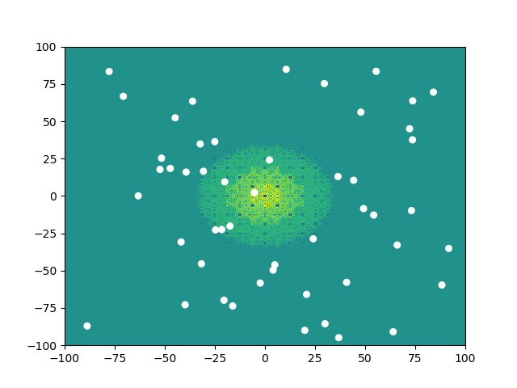
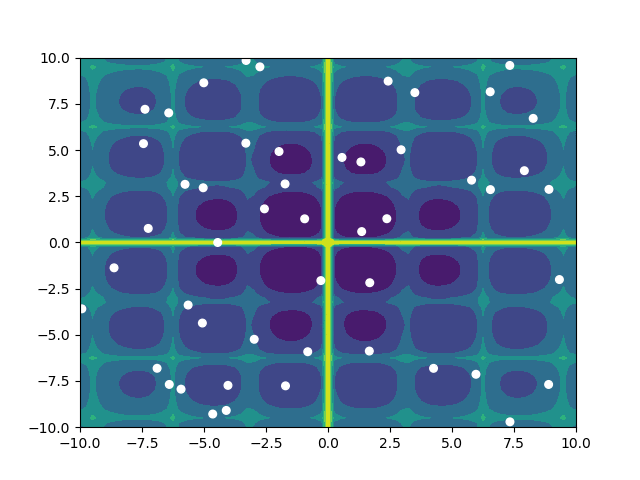

# woa
Python implementation of the Whale Optimization Algorithm

### Description
Python implementation of the [Whale Optimization Algorithm](https://www.sciencedirect.com/science/article/pii/S0965997816300163). Additional information can be found at the [algorithm's webpage](http://www.alimirjalili.com/WOA.html).

## Installation

### Dependancies

- [Python](https://www.python.org/) 3.6
- [SciPy](https://keras.io/) 2.2.4

## Running the code

`python run.py` will run the WOA with default arguments. Run `python run.py --help` to learn more about command line arguments. A few test optimization functions have been included for demonstration purposes. 
